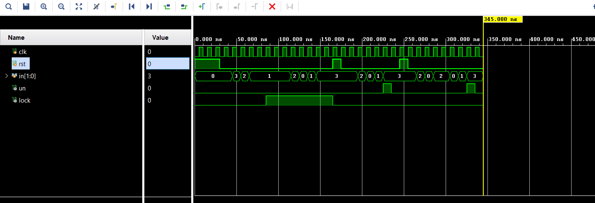

## Digital Lock System — Mealy FSM-based Password Detection

A Mealy Finite State Machine implemented in Verilog that detects
a 4-step 2-bit password sequence and locks permanently after
3 incorrect key presses.

---

## Overview

This project implements a digital combination lock using a Mealy FSM.
The system accepts one 2-bit input per clock cycle and unlocks only
when the correct 4-step sequence is entered in order. Any wrong key
press at any state resets the FSM to S0 and increments an attempt
counter (named as k). After 3 wrong key presses the system locks and ignores
all inputs until an external reset is applied.

---

## Password Sequence

| Step   | Expected Input | Transition       |
|:------:|:--------------:|:----------------:|
| Step 1 | `2'b10`        | S0 → S1          |
| Step 2 | `2'b00`        | S1 → S2          |
| Step 3 | `2'b01`        | S2 → S3          |
| Step 4 | `2'b11`        | S3 → S0 + `un=1` |

**Full sequence:** `10 → 00 → 01 → 11`

---

## FSM State Diagram

```text
S0 --[in=10]--> S1 --[in=00]--> S2 --[in=01]--> S3 --[in=11 / un=1]--> S0
|
└── wrong input at any state → back to S0, attempt+1
    attempt >= 3 → lock=1, FSM frozen until rst
```

---

## Inputs and Outputs

| Signal  | Direction | Width | Description                            |
|:-------:|:---------:|:-----:|----------------------------------------|
| `clk`   | Input     | 1-bit | System clock                           |
| `rst`   | Input     | 1-bit | Asynchronous reset (active HIGH)       |
| `in`    | Input     | 2-bit | Password input per clock cycle         |
| `un`    | Output    | 1-bit | Unlock (HIGH when correct password)    |
| `lock`  | Output    | 1-bit | Lock (HIGH after 3 failed key presses) |

---

## How It Works

1. System starts at **S0**, attempt counter = **0**
2. Each clock cycle a 2-bit input is compared against
   the expected value for the current state
3. Correct input advances FSM to the next state
4. Wrong input at any state resets FSM to **S0** and
   increments attempt counter by **1**
5. When in **S3** and input is `2'b11`, `un` asserts HIGH
   and FSM returns to **S0** with attempt counter reset to **0**
6. If attempt counter reaches **3**, `lock=1` is asserted
   and all further inputs are ignored until `rst`

---

## Key Design Decisions

- **Mealy FSM chosen over Moore** — outputs depend on both
  current state and current input. The unlock signal (`un`)
  asserts only when FSM is in **S3** AND input is `2'b11`
  simultaneously. This eliminates the need for a separate
  UNLOCK state, reducing total state count from **5 to 4**.

- **Attempt counter(k) counts wrong key presses, not wrong
  full sequences** — any single wrong key at any state
  increments the counter. This is stricter than
  sequence-level lockout and more realistic for a
  security application.

- **Asynchronous reset** — `always @(posedge clk or posedge rst)`
  ensures the system can be reset at any time independent
  of clock state. Critical for safety in lock designs.

- **2-bit input width** — gives 4 possible values per step
  (`00`, `01`, `10`, `11`), making the password space
  **4⁴ = 256** possible combinations for this sequence length.

---

## Testbench — Cases Verified

| Test | Scenario                          | Expected Result     |
|:----:|-----------------------------------|---------------------|
| 1    | 3 wrong key presses               | `lock = 1`          |
| 2    | Correct sequence while locked     | `un` stays `0`      |
| 3    | Reset after lockout               | `lock` clears to `0`|
| 4    | Correct password after reset      | `un = 1`            |
| 5    | Wrong key mid-sequence → recovers | `un = 1` eventually |

---

## Simulation Results

**Waveform**



---

## Tools Used

- Xilinx Vivado (simulation and synthesis)
- Verilog HDL

---

## What I Learned

- Mealy FSMs produce outputs on transitions rather than
  states — this reduces state count but requires careful
  handling to avoid glitchy outputs from combinational
  input paths.

- Non-blocking assignments (`<=`) take effect after the
  current time step — checking outputs immediately after
  the triggering clock edge gives wrong results. Always
  wait at least one full clock cycle before sampling.

- Attempt counter counts individual wrong key presses,
  not full sequence attempts — a stricter and more
  realistic lockout mechanism for security designs.

- Asynchronous reset priority in always blocks and why
  it matters for safety-critical designs.

---

## Part of My Embedded Systems + FPGA Learning Roadmap

Project 3 in a progressive Verilog digital design series.

[Traffic Light Controller](your-link-here) →
[Sequence Detector 1011](your-link-here) →
**Digital Lock System** ← current →
4-bit ALU → UART Transmitter → FIFO Buffer
